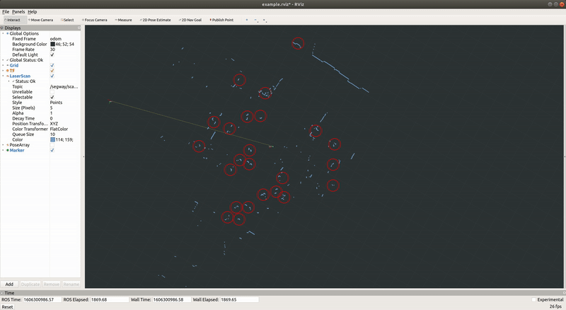
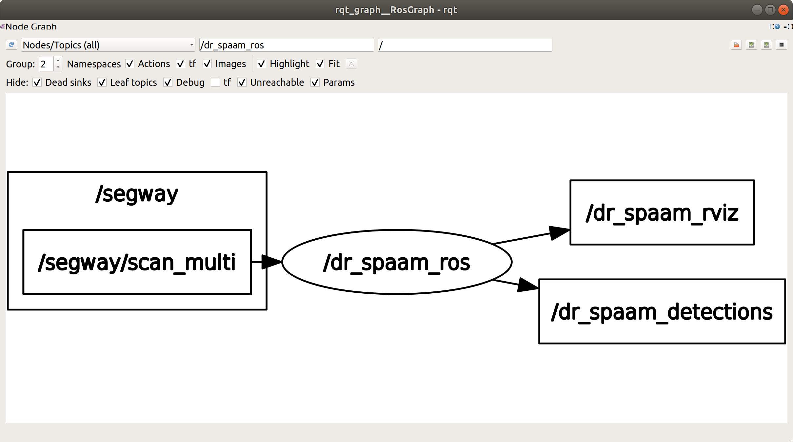

# Person Detection in 2D Range Data
This repository implements DROW3 [(arXiv)](https://arxiv.org/abs/1804.02463) and DR-SPAAM [(arXiv)](https://arxiv.org/abs/2004.14079), real-time person detectors using 2D LiDARs mounted at ankle or knee height.
Also included are experiments from *Self-Supervised Person Detection in 2D Range Data using a Calibrated Camera* [(arXiv)](https://arxiv.org/abs/2012.08890).
Pre-trained models (using PyTorch 1.6) can be found in this [Google drive](https://drive.google.com/drive/folders/1Wl2nC8lJ6s9NI1xtWwmxeAUnuxDiiM4W?usp=sharing).


## Quick start

First clone and install the repository
```
git clone https://github.com/VisualComputingInstitute/2D_lidar_person_detection.git
cd dr_spaam
python setup.py install
```

Use the `Detector` class to run inference
```python
import numpy as np
from dr_spaam.detector import Detector

ckpt = 'path_to_checkpoint'
detector = Detector(
    ckpt,
    model="DROW3",          # Or DR-SPAAM
    gpu=True,               # Use GPU
    stride=1,               # Optionally downsample scan for faster inference
    panoramic_scan=True     # Set to True if the scan covers 360 degree
)

# tell the detector field of view of the LiDAR
laser_fov_deg = 360
detector.set_laser_fov(laser_fov_deg)

# detection
num_pts = 1091
while True:
    # create a random scan
    scan = np.random.rand(num_pts)  # (N,)

    # detect person
    dets_xy, dets_cls, instance_mask = detector(scan)  # (M, 2), (M,), (N,)

    # confidence threshold
    cls_thresh = 0.5
    cls_mask = dets_cls > cls_thresh
    dets_xy = dets_xy[cls_mask]
    dets_cls = dets_cls[cls_mask]
```

## ROS node





We provide an example ROS node `dr_spaam_ros`. 
First install `dr_spaam` to your python environment.
Then compile the ROS package 
```
catkin build dr_spaam_ros
```

Modify the topics and the path to the pre-trained checkpoint at 
`dr_spaam_ros/config/` and launch the node
```
roslaunch dr_spaam_ros dr_spaam_ros.launch
```

For testing, you can play a rosbag sequence from JRDB dataset.
For example,
```
rosbag play JRDB/test_dataset/rosbags/tressider-2019-04-26_0.bag
```
and use RViz to visualize the inference result.
A simple RViz config is located at `dr_spaam_ros/example.rviz`.

In addition, if you want to test with DROW dataset, you can convert a DROW sequence to a rosbag
```
python scripts/drow_data_converter.py --seq <PATH_TO_SEQUENCE> --output drow.bag
```

## Training and evaluation

Download the [DROW dataset](https://github.com/VisualComputingInstitute/DROW) and the [JackRabbot dataset](https://jrdb.stanford.edu/),
and put them under `dr_spaam/data` as below.
```
dr_spaam
├── data
│   ├── DROWv2-data
│   │   ├── test
│   │   ├── train
│   │   ├── val
│   ├── JRDB
│   │   ├── test_dataset
│   │   ├── train_dataset
...
``` 

First preprocess the JRDB dataset (extract laser measurements from raw rosbag and synchronize with images)
```
python bin/setup_jrdb_dataset.py
```

To train a network (or evaluate a pretrained checkpoint), run
```
python bin/train.py --cfg net_cfg.yaml [--ckpt ckpt_file.pth --evaluation]
```
where `net_cfg.yaml` specifies configuration for the training (see examples under `cfgs`).

## Self-supervised training with a calibrated camera

If your robot has a calibrated camera (i.e. the transformation between the camera to the LiDAR is known),
you can generate pseudo labels automatically during deployment and fine-tune the detector (no manual labeling needed).
We provide a wrapper function `dr_spaam.pseudo_labels.get_regression_target_using_bounding_boxes()` for generating pseudo labels conveniently.
For experiments using pseudo labels,
checkout our paper *Self-Supervised Person Detection in 2D Range Data using a Calibrated Camera* [(arXiv)](https://arxiv.org/abs/2012.08890).
Use checkpoints in this [Google drive](https://drive.google.com/drive/folders/1Wl2nC8lJ6s9NI1xtWwmxeAUnuxDiiM4W?usp=sharing) to reproduce our results.

## Inference time
On DROW dataset (450 points, 225 degrees field of view)
|        | AP<sub>0.3</sub> | AP<sub>0.5</sub> | FPS (RTX 2080 laptop) | FPS (Jetson AGX Xavier) |
|--------|------------------|------------------|-----------------------|------------------|
|DROW3   | 0.638 | 0.659 | 115.7 | 24.9 |
|DR-SPAAM| 0.707 | 0.723 | 99.6 | 22.5 |

On JackRabbot dataset (1091 points, 360 degrees field of view)
|        | AP<sub>0.3</sub> | AP<sub>0.5</sub> | FPS (RTX 2080 laptop) | FPS (Jetson AGX Xavier) |
|--------|------------------|------------------|-----------------------|------------------|
|DROW3   | 0.762 | 0.829 | 35.6 | 10.0 |
|DR-SPAAM| 0.785 | 0.849 | 29.4 | 8.8  |

Note: Evaluation on DROW and JackRabbot are done using different models (the APs are not comparable cross dataset).
Inference time was measured with PyTorch 1.7 and CUDA 10.2 on RTX 2080 laptop,
and PyTorch 1.6 and L4T 4.4 on Jetson AGX Xavier.

## Citation
If you use this repo in your project, please cite:
```BibTeX
@article{Jia2021Person2DRange,
  title        = {{Self-Supervised Person Detection in 2D Range Data using a
                   Calibrated Camera}},
  author       = {Dan Jia and Mats Steinweg and Alexander Hermans and Bastian Leibe},
  booktitle    = {International Conference on Robotics and Automation (ICRA)},
  year         = {2021}
}

@inproceedings{Jia2020DRSPAAM,
  title        = {{DR-SPAAM: A Spatial-Attention and Auto-regressive
                   Model for Person Detection in 2D Range Data}},
  author       = {Dan Jia and Alexander Hermans and Bastian Leibe},
  booktitle    = {International Conference on Intelligent Robots and Systems (IROS)},
  year         = {2020}
}
```
